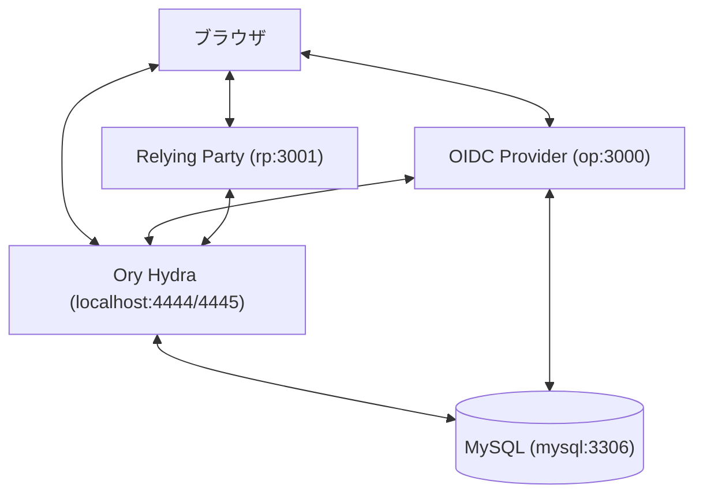

# Rails Station: OIDC & Single Sign-Out Demo

OIDC (OpenID Connect) プロバイダー（OP）とメインターゲットアプリケーションである Relying Party（RP）を組み合わせた、認証およびシングルサインアウト（Single Sign-Out / Back-channel Logout）の検証用サンドボックスプロジェクトです。

## 全体アーキテクチャ

本プロジェクトは以下のコンポーネントで構成されており、Docker Compose を使用してワンコマンドで起動・連携させることができます。



1. **Ory Hydra (OIDC Engine)**:
   * 認可コードフローやトークン発行、JWKS公開鍵管理を担う軽量なOIDCエンジン。
2. **OIDC Provider (OP - `op`)**:
   * Ory Hydra の Login & Consent Flow と連携する Rails アプリケーション。
   * Devise によるユーザー管理機能を提供します。
3. **Relying Party (RP - `rp`)**:
   * OmniAuth OIDC を使用して、OPのアイデンティティ情報を用いてログインするクライアント側の Rails アプリケーション。
   * **Back-channel Logout 1.0** に準拠したログアウトハンドラーを搭載しています。

---

## クイックスタート (起動方法)

### 動作要件
* Docker / Docker Compose

### 1. アプリケーションの起動

プロジェクトのルートディレクトリで以下のコマンドを実行し、コンポーネントを立ち上げます。

```bash
docker compose up --build -d
```

このコマンドにより、MySQL、Ory Hydra、OP アプリ、RP アプリが自動的に構築・起動されます。さらに、`hydra-setup` コンテナによって OAuth2 クライアント（`rp-client`）の自動登録が行われます。

### 2. 初期データベースセットアップ

コンテナの起動完了後、OPおよびRPそれぞれのデータベース移行（マイグレーション）を実行します。

```bash
# OP アプリのマイグレーション
docker compose exec op bin/rails db:migrate

# RP アプリのマイグレーション
docker compose exec rp bin/rails db:migrate
```

### 3. テスト用のシードユーザーの作成

OP アプリ側にログイン用のシードユーザー（テストアカウント）を作成します。

```bash
docker compose exec op bin/rails db:seed
```
* **テスト用アカウント**:
  * メールアドレス: `user@example.com`
  * パスワード: `password`

---

## 動作確認の手順

1. ブラウザで **Relying Party (RP) 画面**（`http://localhost:3001`）を開きます。
2. 「Login via OIDC」ボタンをクリックします。
3. **Ory Hydra** および **OP (OIDC Provider)** へリダイレクトされます。
4. シードユーザー情報 (`user@example.com` / `password`) を入力してログインします。
5. 認可承諾（Consent）画面が表示されるので「Allow」を選択します。
6. ログインが成功すると、RP 画面（`http://localhost:3001`）へ戻り、ログインセッションが確立されます。

### シングルサインアウトの確認

1. **OP 画面**（`http://localhost:3000`）へアクセスします。
2. 画面上のログアウトを実行、あるいは `DELETE /users/sign_out` リクエストを送信します。
3. OP 側で Devise セッションが削除されると同時に、Ory Hydra のパブリックログアウトエンドポイントへ自動的に転送されます。
4. Ory Hydra が RP アプリ（`rp`）のバックチャネルログアウトAPIへ署名付きトークンを送信し、RP側のアクティブセッションもバックグラウンドで破棄されます。
5. 再び RP アプリ（`http://localhost:3001`）へ戻りページをリロードすると、自動的にログアウト状態になっていることが確認できます。

---

## テストの実行方法

各アプリケーションのテストスイートは以下のコマンドで実行できます。

```bash
# RP (Relying Party) のテスト実行 (署名検証、リプレイ対策、JWKSローテーション等)
docker compose exec rp bin/rails test

# OP (OIDC Provider) のテスト実行
docker compose exec op bin/rails test
```
